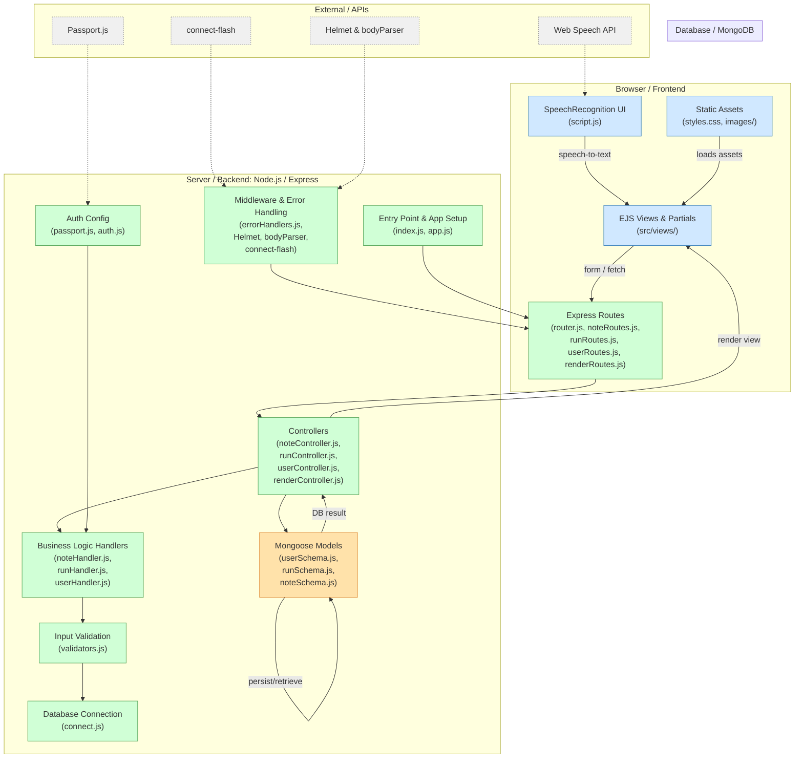

# 🏃‍♀️ Jog Your Memory with **RunningThoughts**

**RunningThoughts** is inspired by a runner I know who hits the pavement with sneakers and an audiobook and returns home with a reminders app full of thoughts. The goal of RunningThoughts is to:

- Organize thoughts by *run*
- Mark off items after you’ve discussed them
- Make recording a thought easy with a UI that puts speech-to-text at its forefront

Built with: **Node.js**, **Express**, **MongoDB**, **EJS**, and **Bootstrap (Bootswatch "Brite" theme)**.
User authentication via **Passport.js**

🚀 [**Live Demo on Render** »](https://runningthoughts.onrender.com)

---

## ⚙️ Setup

1. Clone the repo and install dependencies.
2. Create a `.env` file with your environment variables:
  - URI (MongoDB connection string)
  - PORT
  - PASSPORT_SECRET
  - PASSPORT_COOKIE
4. To enable localhost, comment out `helmet` config lines in app.js - line 21-38.
5. Run the app:  
   ```bash
   node ./src/index.js

---

## ✨ Features

### 🧠 Organize Your Thoughts by Run

Each note belongs to a **run**, and are grouped as such on the dashboard. Clicking into a run gives you a focused view of that session.

Within a run, you can:
- **Add a title** — By default, the frontend will display the creation date of the run as the title unless you specify a custom one.
- **Clear the run** — Delete all notes from a run.
- **Delete the run** — Remove the run and its notes entirely. If this was your current run, your user record will be updated accordingly.


### ✅ Check Notes Off

Each note includes a checkbox to indicate whether it’s been discussed.

- Notes start as **open** (`open: true` in MongoDB).
- Toggling the checkbox sends a PUT request to toggle this property.
- You can view **all notes**, or **only open notes**, for better focus.
- The `tot_open_notes` field in run documents helps collapse run cards when filtering for open notes only.


### 🚹  Accessibility-First Design

- Tap the **mic button** to start recording a note. Tap again to save.
- Tapping **"New Note"** does *not* start recording automatically, giving the user more control when they want to type out their thoughts.
- Editing a note and tapping the mic appends new speech-to-text at the end of your note draft.
- The mic button is intentionally **large, visible, and mobile-friendly** for use while on the move.


### 🔄 Current Run Logic

RunningThoughts keeps track of your **current run** — the run you last created a note in, within the past 2 hours. It tracks this run and its timing in the user document under `current_run` and `currentRunUpdatedAt`.

- **From the dashboard**: Notes go into your current run. If none exists, a new one is created automatically.
- **From a run page**: Notes are added to that run. That run then becomes your new current run.


### 🔧 Other

- **Efficient data modeling**: Each user can have multiple runs and notes. Summary fields like `tot_notes`, `tot_open_notes`, and `tot_runs` allow quick access without extra queries.
- **Pagination**: Dashboard displays 10 runs per page, with pagination based on `tot_runs` for a given user.
- **Error handling**: Uses `connect-flash` for frontend alerts and `create-http-errors` for custom error statuses and messages.
- **User settings**:
  - Update email and username
  - Change password (via Passport.js)
  - Delete your entire account, or just all of your runs and notes data.
- **Sanitization**: Inputs like usernames, titles, and notes are sanitized with `sanitize-html`. For notes content, whitespace is trimmed and the first character capitalized. This is especially important for speech-to-text input, which can otherwise end up a little messy.
- **Modal confirmations**: Destructive actions (delete note/run/account) require modal confirmation.

---

## 🐞 Problems encountered

### ⚠️ Flash Message Conflicts

When building the app, I originally used a mix of traditional HTML form submissions and JavaScript `fetch()` requests.

This led to a major issue: **flash messages were often discarded** before they could be rendered on the page. This was due to the way some fetch-based requests would redirect and reload the page twice, interrupting the flash message lifecycle.

**Solution**: I converted most of the fetch-based requests to traditional HTML forms to maintain proper redirect and flash message behavior. One fetch-based request remains — toggling a note’s open/closed state. A full page reload is quite disruptive when using this feature, so trading off more robust error handlign was necessary here at this time.


### 🎙 Web Speech-to-Text Limitations

The app uses WebKit’s built-in `SpeechRecognition` API for speech-to-text input. While functional, it's **not nearly as accurate or smooth** as the experience we're now used to with Siri or Google assistant.

For now, this works as a proof of concept. A mobile app in the future could tap into native mobile speech APIs, offering much better recognition, background listening, and more reliable input — ideal for runners on the move.

---

## 🗂 File Structure

[Click here for diagram](https://gitdiagram.com/kyrawest/runningthoughts). [Created with GitDiagram](https://gitdiagram.com/kyrawest/runningthoughts).



---

## Screen recordings and Demos:

## Screenshots and Demos:


<table>
  <tr>
    <td align="center"><strong>Toggling open/closed state</strong><br>
      
    </td>
    <td align="center"><strong>Editing run title</strong><br>
      
    </td>
    <td align="center"><strong>Speech-to-text note creation</strong><br>
      
    </td>
  </tr>
</table>


